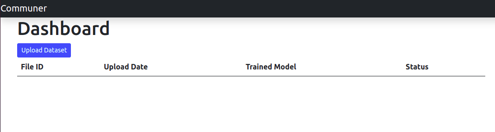
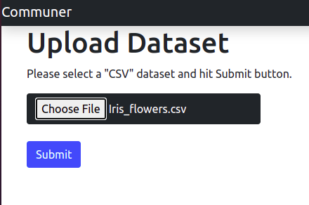
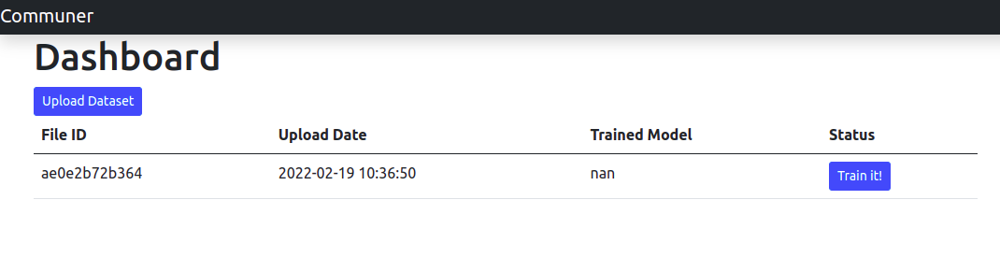
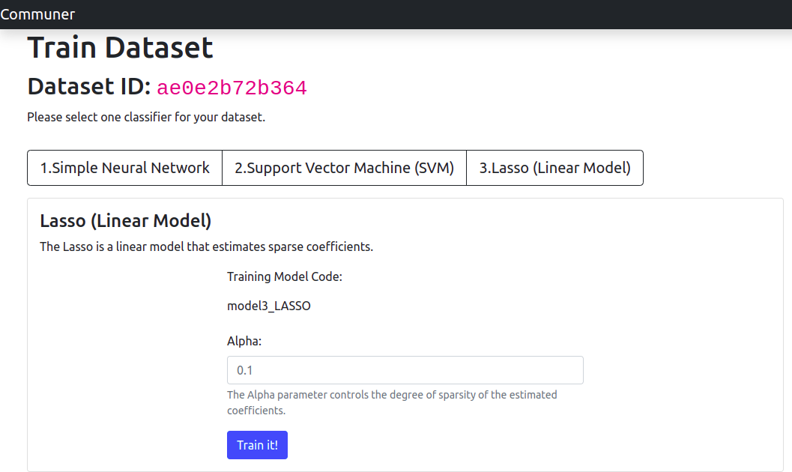
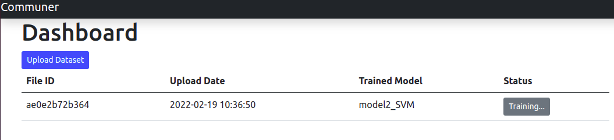
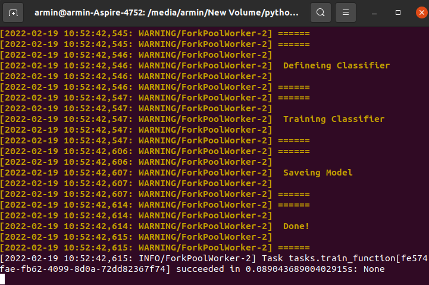
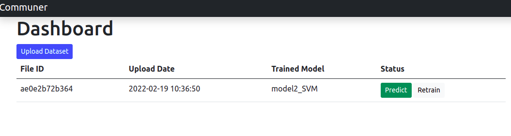
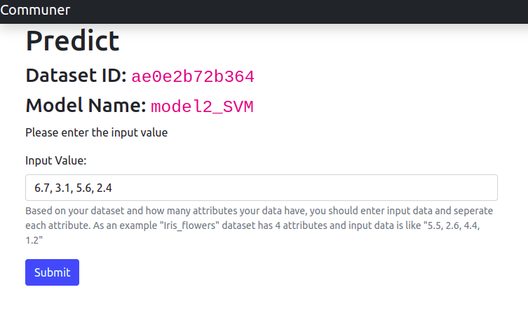
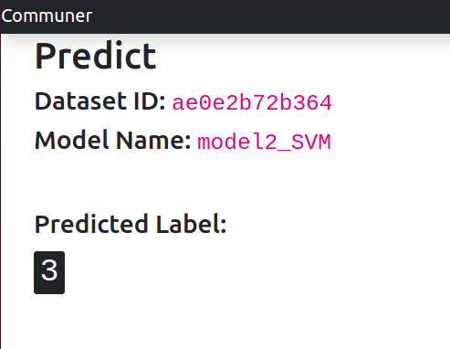

# Classification Web-app

A Flask application to upload datasets, choose classifier, train classifier and predict unforeseen results. This app uses __Celery__ to train data in background without making difficulties for main performance of the app.

## How to Install
Prior to installing the application doing some steps are critical. Using Anaconda is recommended and installation process is preformed with that assumption.
### Pre-installation
#### Step1: RabbitMQ
In order to use this code you need to install RabbitMQ broker. The installation is simple and you can find useful information about it [here](https://www.rabbitmq.com/download.html).

If you are in Ubuntu 20.04 you can simply install it by:
```
sudo apt-get install rabbitmq-server
```
#### Step2: Anaconda
You can find and download the best version of Anaconda for your OS [here](https://docs.anaconda.com/anaconda/install/index.html). Make sure you install *Anaconda3* so that you can use *Python3*.

### Installation
#### Step1: Create New Environment
After you have installed RabbitMQ and Anaconda3, create an Anaconda environment is the first step:
```
conda create --name arminenv python=3.7
```
following the installation, activating environment is the next thing to do:
```
conda activate arminenv
```
__Note:__ `arminenv` is the name of your environment. If you use a different name while creating it, use that name to activate the environment.
#### Step2: Requirements
Download this repository and run the code below while you are inside the repo-folder:
```
pip install -r requirements.txt
```

## How to Run
Because this application uses `celery` to simulate doing a task on another server, you two separate terminals to run.
#### Step1: Run Celery
Inside repo folder, open a terminal and run the code below:
```
celery -A tasks worker --loglevel=INFO
```
This will initiate the Celery worker and activates background processing.

__Note:__ Keep this terminal runing and do not close it while your app is the run.


#### Step2: Run the App
 Inside repo folder, open __another__ terminal and run the code below:
 ```
 python app.py
 ```
Next, you can use the app inside your browser at:
 ```
http://localhost:5000/
```
## How to Use
This application is a simple user-friendly web-app to train a database and classify unforeseen inputs.

#### Step0: Database
Prior to any further steps, your database must follow a certain order.
- Your database should be in `CSV` format
- Each row represents an input data
- The last column of each row is the Lablel for that input data
- Labels must be in __Numbers__. Any string label is not acceptable

There is `Iris_flowers.csv` inside `Example Dataset` that you can use as an example database. You can find more information about Iris_flowers dataset [here](https://en.wikipedia.org/wiki/Iris_flower_data_set).

#### Step1: Upload Database
If you run the application for the first time, you can see there is an empty table that should store your training history.
In order to upload a new database hit the `Upload Dataset` button.




It will lead you to another page where you can choose your desired data base. After choosing your data base, hit `Submit` button to start uploading process.



#### Step2: Train Database
When uploading is done, you will return to Dashboard but a new row is added to the table. Important information such as File_ID, Upload Date,	Trained Model and	Status can be seen.
In order to train a database hit `Train it!` button.



On Train Dataset page, there is 3 classifier that can be chosen for your data. Select one and set parameters as you wish then hit `Train it!` button.



Training process happens on Celery therefore, the app leads you to Dashboard immediately. You will see gray badge in front of your File_ID saying `Training...` which means training hasn't finished yet.




#### Step3: Predict
If you refresh your Dashboard after some seconds, a `Predict` button will appear (`Retrain` button let you train a different classifier with new settings on your database).
Using Predict button, Predict webpage appears.



Based on your database and number of its attributes, you have to enter an input value and hit `Submit` button.



Your prediction will be shown next:


